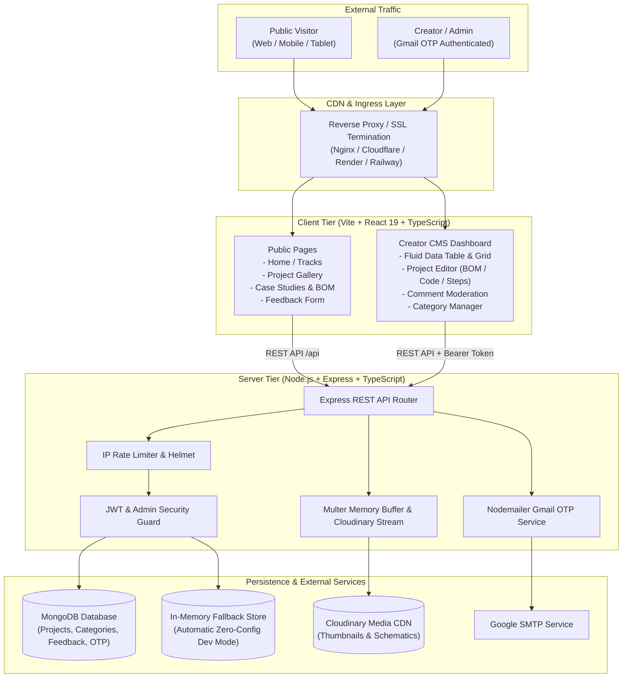

# ⚡ Tech Curious — Complete System Architecture & Production Blueprint

**Project Name:** Tech Curious  
**Purpose:** Public-facing portfolio & hardware tutorial showcase for an Electronics / Robotics / IoT YouTube creator with an integrated, passwordless Admin CMS backend.

---

## 1. High-Level Architecture Diagram



---

## 2. Technology Stack & Technical Rationale

| Layer | Technology | Rationale & Architectural Choice |
|---|---|---|
| **Frontend Framework** | **React 19** + **TypeScript** | Strict type safety across all project models, BOM items, and code snippets. |
| **Build Tool** | **Vite 6** | Sub-second HMR in development, optimized rollup production chunking (~4.7s build). |
| **Styling** | **Tailwind CSS v3** + **Vanilla CSS** | Dynamic dark/light design system (Obsidian Slate `#090A0F` & Crisp Slate `#FAFAFA`). |
| **Typography** | **Plus Jakarta Sans** + **Inter** + **JetBrains Mono** | Engineering-grade hierarchy for headlines, body, telemetry, and code viewers. |
| **Icons** | **Lucide React** | Consistent SVG vector iconography with lightweight tree-shaking. |
| **Backend Framework** | **Node.js 22** + **Express 4.21** (ES Modules) | High-throughput asynchronous I/O with native ESM module resolution. |
| **Language** | **TypeScript 5.7** | Strict type guarantees shared between frontend types and backend controllers. |
| **Database** | **MongoDB** + **Mongoose 8** | Flexible schema for dynamic multi-step tutorials, BOM arrays, and code files. |
| **Fallback Store** | **In-Memory Dual-Mode Engine** | Zero-downtime development fallback if MongoDB is not yet provisioned. |
| **Authentication** | **Gmail OTP + JWT (HMAC-SHA256)** | Passwordless, brute-force-proof creator access via one-time 6-digit passwords. |
| **Media Hosting** | **Cloudinary v2** + **Multer** | Direct memory streaming with automatic WebP conversion and responsive resizing. |
| **Security** | **Helmet** + **CORS** + **express-rate-limit** | Production headers, origin whitelisting, reverse proxy trust, and brute-force defenses. |

---

## 3. Directory Structure

```
Tech-curious/
├── Dockerfile                  # Multi-stage production container build
├── docker-compose.yml          # Local fullstack deployment with MongoDB
├── ARCHITECTURE.md             # Complete architecture blueprint
├── test-e2e.js                 # Automated API test suite (8 integration tests)
├── package.json                # Root monorepo scripts (build, start, dev)
│
├── client/                     # Frontend Application
│   ├── index.html              # HTML entrypoint with Plus Jakarta Sans & Inter
│   ├── vite.config.ts          # Vite build config with API proxy
│   ├── tailwind.config.js      # Minimalist dark/light color tokens
│   ├── src/
│   │   ├── assets/             # Vector semiconductor chip logos (dark/light)
│   │   ├── components/
│   │   │   ├── admin/          # AdminSidebar, ProjectTable, ProjectEditor, Moderation
│   │   │   ├── layout/         # Floating pill Navbar, SearchModal, Footer
│   │   │   └── projects/       # ProjectCard, ProjectGrid, CodeBlock, BOM, StepList
│   │   ├── context/            # ThemeContext, AuthContext
│   │   ├── lib/                # Axios API client, TypeScript types, utils
│   │   ├── pages/              # Home, Projects, ProjectDetail, AdminDashboard, Login
│   │   ├── App.tsx             # Route definitions & page layout wrappers
│   │   └── main.tsx            # React DOM mounting
│   └── dist/                   # Production-compiled assets
│
└── server/                     # Backend Application
    ├── tsconfig.json           # Server TypeScript config (ESNext, NodeNext)
    ├── package.json            # Server dependencies and build scripts
    ├── src/
    │   ├── config/             # MongoDB connection, Cloudinary integration
    │   ├── controllers/        # Project, Auth, Category, Feedback, Contact handlers
    │   ├── middleware/         # requireAdmin guard, rateLimiter, errorHandler
    │   ├── models/             # Mongoose schemas (Project, Feedback, Category, OTP)
    │   ├── routes/             # REST route declarations (/api/*)
    │   ├── services/           # In-memory fallback store & email delivery
    │   └── server.ts           # Express server setup, static serving, graceful shutdown
    └── dist/                   # Production-compiled JavaScript (tsc)
```

---

## 4. Security & Authentication Architecture

### 4.1. Passwordless Admin Authentication Flow
1. **Request Phase**:
   - The admin navigates to `/admin/login` and submits their email address.
   - The server validates against the authorized `ADMIN_EMAIL` whitelist.
   - A cryptographically random 6-digit OTP is generated.
   - The OTP is hashed using `bcrypt` (10 salt rounds) and saved to MongoDB / fallback store with a strict **5-minute TTL index**.
   - An email is sent via Google SMTP (or printed to the development console in dev mode).
2. **Verification Phase**:
   - The admin inputs the 6-digit code.
   - The server verifies the bcrypt hash and checks expiration.
   - Upon success, the OTP record is purged immediately (single-use token).
   - An HMAC-SHA256 JWT is signed with `JWT_SECRET` (24-hour expiration).
   - The JWT is returned both in an `httpOnly`, `sameSite: "lax"`, `secure` cookie AND as a Bearer token in the JSON payload for flexible client consumption.
3. **Guard Phase**:
   - Protected routes (`POST /api/projects`, `PUT /api/projects/:id`, `DELETE /api/projects/:id`, `DELETE /api/feedback/:id`) pass through `requireAdmin.ts`.
   - The middleware inspects `req.cookies.tc_admin_token` or `Authorization: Bearer <token>`.

---

## 5. API Endpoints Reference

| Method | Endpoint | Access | Purpose |
|---|---|---|---|
| `GET` | `/api/health` | Public | System health check and uptime probe |
| `GET` | `/api/projects` | Public | List published projects with search, category, and sort |
| `GET` | `/api/projects/:slug` | Public | Retrieve full project tutorial by slug and increment views |
| `POST` | `/api/projects/:id/like` | Public | Toggle unique like per device ID |
| `GET` | `/api/projects/admin/all` | **Admin** | Retrieve all projects (including drafts) |
| `POST` | `/api/projects` | **Admin** | Create new project tutorial with file upload |
| `PUT` | `/api/projects/:id` | **Admin** | Update project fields, status, steps, BOM, or code |
| `DELETE` | `/api/projects/:id` | **Admin** | Delete project and cascade delete associated feedback |
| `GET` | `/api/categories` | Public | List domain categories (Robotics, IoT, PCB, etc.) |
| `POST` | `/api/categories` | **Admin** | Add new category |
| `DELETE` | `/api/categories/:id` | **Admin** | Delete category |
| `GET` | `/api/feedback/:projectId` | Public | Get approved comments for a project |
| `POST` | `/api/feedback/:projectId` | Public | Submit community question/rating (rate-limited) |
| `GET` | `/api/feedback/admin/all` | **Admin** | Retrieve all feedback for moderation |
| `DELETE` | `/api/feedback/:id` | **Admin** | Delete inappropriate comment |
| `POST` | `/api/contact` | Public | Submit inquiry message from footer |
| `POST` | `/api/auth/request-otp` | Public | Request 6-digit login OTP (rate-limited) |
| `POST` | `/api/auth/verify-otp` | Public | Verify OTP and obtain admin session token |
| `GET` | `/api/auth/me` | Public | Inspect current session validity |
| `POST` | `/api/auth/logout` | **Admin** | Clear admin cookie |

---

## 6. Production Deployment Guides

### Option A: Monorepo Single-Service Deployment (Render / Railway)
The backend server automatically serves the compiled `client/dist` directory in production.

1. **Build Command**:
   ```bash
   npm run install:all && npm run build
   ```
2. **Start Command**:
   ```bash
   npm start
   ```
3. **Environment Variables**:
   ```env
   NODE_ENV=production
   PORT=5000
   MONGO_URI=mongodb+srv://<user>:<password>@cluster.mongodb.net/tech-curious?retryWrites=true&w=majority
   JWT_SECRET=generate_a_64_char_random_hex_string
   ADMIN_EMAIL=your_email@gmail.com
   CLIENT_URL=https://your-domain.com
   GMAIL_USER=your_email@gmail.com
   GMAIL_APP_PASSWORD=your_16_digit_app_password
   CLOUDINARY_CLOUD_NAME=your_cloud_name
   CLOUDINARY_API_KEY=your_api_key
   CLOUDINARY_API_SECRET=your_api_secret
   ```

---

### Option B: Docker Container Deployment
Use the included multi-stage `Dockerfile` and `docker-compose.yml`:

```bash
# Build and start both app and MongoDB
docker compose up -d --build

# View container logs
docker compose logs -f app
```

---

### Option C: Decoupled Deployment (Vercel Frontend + Render Backend)

1. **Client on Vercel**:
   - Root directory: `client`
   - Build command: `npm run build`
   - Output directory: `dist`
   - Environment variable: `VITE_API_URL=https://api.yourdomain.com/api`
2. **Server on Render / Railway**:
   - Root directory: `server`
   - Build command: `npm run build`
   - Start command: `npm start`
   - Environment variable: `CLIENT_URL=https://your-frontend.vercel.app`
